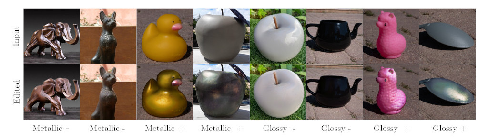
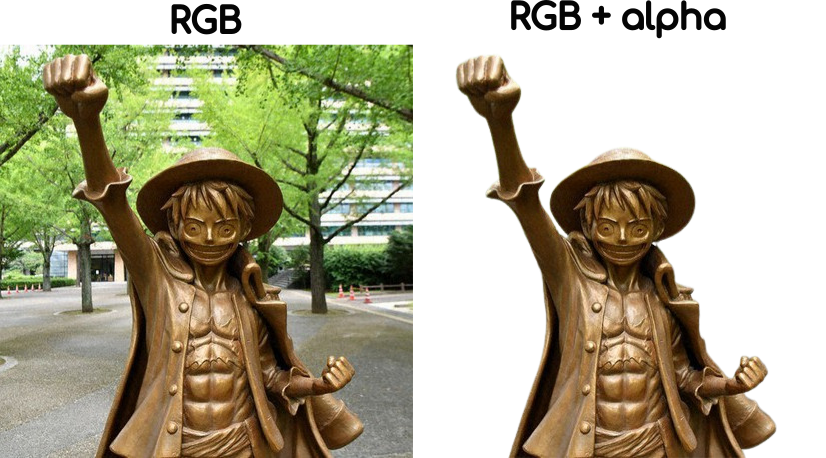
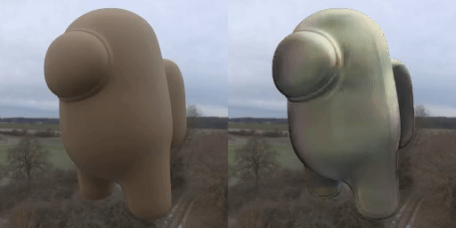
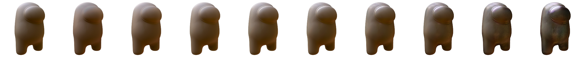

# In-the-wild Material Appearance Editing using Perceptual Attributes 

### [Project Page](https://dsubias.github.io/publication/in-the-wild_editing/) | [Paper](https://arxiv.org/pdf/2302.03619.pdf) | [Data](https://drive.google.com/drive/folders/10qsYxPXR4cperbbkzmMNM0MKGNpj3kSx?usp=share_link)

The official **PyTorch**  implementation of [**In-the-wild Material Appearance Editing using Perceptual Attributes**](). 


[J. Daniel Subias](https://dsubias.github.io/#about)<sup>1</sup>,
[Manuel Lagunas](https://mlagunas.me/)<sup>2</sup>

<sup>1</sup>**Universidad de Zaragoza, I3A, Spain**, <sup>2</sup>**Amazon**

In **Eurographics 2023** (Oral Presentation)



## TL;DR Quickstart
```
# Clone repository and enter in the folder
git clone git@github.com:dsubias/in-the-wild_editing.git
cd in-the-wild_editing

# Download pretrained models
bash download_models.sh

# Create a python environment
python -m venv editing_env
source editing_env/bin/activate
pip install -r requirements.txt

# Create example image
python format_images.py

# Run the editing framework
editing_network.py -a glossy

# Deactivate the python environment
deactivate
```

If everything works without errors,  you can now go to `edited_images` and watch a teaser like this:


**Notice**: the first one corresponds to the original image taken from [here](https://cdn.mainichi.jp/vol1/2020/08/28/20200828p2a00m0na015000p/8.jpg?2).

## Editing Parameters

The editing script `editing_network.py` has the following parameters:

- `-a`: the target high-level perceptual attribute: `glossy` or `metallic`, **default**: glossy.
- `-max`: the maximun value for the attribute, **default**: 1.
- `-min`: the minimun value for the attribute, **default**: 0.125.
- `-n`: number of samples generated between the minimun and maximun attribute values, **default**: 4.
- `-b`: if set to False the background is omitted in the edited images, **default**: True.
- `-v`: if set to True the input folder is `frames` and the program builds a video where each frame is edited taking the maximum value of the attribute, **default**: False.

## Setup

Python 3 dependencies:

* [PyTorch 1.13.1](https://pytorch.org)
* [CUDA 11.7](https://developer.nvidia.com/cuda-downloads) 
* [tensorboardX 2.6](https://github.com/lanpa/tensorboardX)
* [tqdm](https://github.com/tqdm/tqdm)
* [Pillow](https://github.com/python-pillow/Pillow)
* [easydict](https://github.com/makinacorpus/easydict)
* [pytorch-msssim](https://github.com/VainF/pytorch-msssim)
* [MoviePy](https://zulko.github.io/moviepy/) (For video editing)

Download the trained weights:

```
bash download_models.sh
```

We provide a requirements file including all of the above dependencies to create an environment. Create the python environment `editing_env` by running:

```
python -m venv editing_env
source editing_env/bin/activate
pip install -r requirements.txt
```

## Image Format

To edit your own images of a single object, you can add new images to `test_images` in `PNG` format. The RGB channels must depict the object and background and the alpha channel must be the shiluete of the object, like this:



To do this, you can copy the original RGB image (e.g in format `JPEG`) in `original_images` and a masked version of the image (e.g generated by [remove.bg](https://www.remove.bg/) and in format `PNG`) in `masked_images` with the **same name as the original one** and run:

```
python format_images.py
```

This command resizes the RGB images and the alpha channels to 256x256 px. and outputs the final masked images in format `PNG`. You can download the rest of real data used in the paper [here](https://drive.google.com/file/d/1qGT4KHNapFnYPGVg6-1x97oJKnsckdU7/view?usp=share_link). 

## Video Editing

You can also edit a video by coping its frames in `frames` using the same format presente above, you can download an example [here](https://drive.google.com/file/d/1_lP7f0BueNwrxpOALa9whiorImj53DsX/view?usp=share_link). The run the following comand:

```
editing_network.py -v True
```

If everything works without errors,  you can now go to `edited_video` and watch a video like this:



**Notice**: the left video corresponds to the original one.

## Organization of the Code

* `agents` : The optimisation scheme. `STGANAgent` is an abstract agent that regroup some basic training functions, similar to Pytorch lighting abstraction.
* `models` : code of the STGAN architecture
* `datasets` : code to read the datasets
* `utils` : various utilities
* `configs` : configuration files to launch the trainings or test
* `experiments` : snapshots of experiments

## Training

Download the training data [here](https://drive.google.com/file/d/1Z5wEFox1fWaBqmwMskShkzBudyc_dWdU/view?usp=share_link) and move them to `data`. For quickly start to train a model, you can simply use the following command:

```
python train_network.py 
```

After 51k iterations, you should get a teasers like this:



If you want to modify some hyper-parameters, please edit them in the configuration file `./configs/train_network.yaml` following the explanations below:

- `exp_name`: the name of current experiment.
- `mode`: `train`, `edit_images`, `edit_video` or `plot_metrics`
- `cuda`: use CUDA or not.
- `ngpu`: how many gpu cards to use. **Notice**: this number should be equal than the length of `gpus_list`.
- `gpus`: list of gpus to train.
- `data_root`: the root of dataset.
- `out_root`: the root to output experiments.
- `train_file`: the file with the ground-truth attribute labels and image names used to train the network.
- `val_file`: the file with the synthetic or ground-truth attribute values and image names used to validate editing ability of the network or compute metrics.
- `crop_size`: size of the crop used in the data augmentation.
- `image_size`: size of the image used during training.
- `data_augmentation`: use DATA AUGMENTATION or not.
- `mask_input_bg`: use MASK or not.
- `g_conv_dim`: the base filter numbers of convolutional layers in G.
- `d_conv_dim`: the base filter numbers of convolutional layers in D.
- `d_fc_dim`: the dimmension of fully-connected layers in D.
- `g_layers`: the number of convolutional layers in G. **Notice**: same for both encoder and decoder.
- `d_layers`: the number of convolutional layers in D.
- `shortcut_layers`: the number of skip connections in G. **Notice**: also the number of STUs.
- `stu_kernel_size`: the kernel size of convolutional layers in STU.
- `use_stu`:  if set to False, there will be no STU in skip connections.
- `deconv`: if set to False, there will be no deconvolutions in G, D and STUs.
- `one_more_conv`: if set to True, there will be another convolutional layer between the decoder and generated image.
- `batch_size`: batch size of data loader.
- `beta1`: beta1 value of Adam optimizer.
- `beta2`: beta2 value of Adam optimizer.
- `g_lr`: the base learning rate of G.
- `d_lr`: the base learning rate of D.
- `n_critic`: the number of D updates per each G update.
- `use_d`: if set to False, only G is trained.
- `checkpoint`: the iteration step number of the checkpoint to be resumed. **Notice**: please set this to **~** if it's first time to train.
- `att_min`: min attribute value for the teasers generated in the validation stept.
- `att_max`: max attribute value for the teasers generated in the validation stept.
- `num_samples`: number of samples for the teasers generated in the validation stept.
- `lambda_gp`: tradeoff coefficient of D_loss_gp.
- `lambda_1`: tradeoff coefficient of D_loss_att.
- `lambda_2`: tradeoff coefficient of G_loss_att.
- `lambda_3`: tradeoff coefficient of G_loss_att.
- `attrs`: the target attribute: `glossy` or `metallic`.
- `uniform`:  if set to False, ramdom permutations of the attribute labels will be use to generate fake images during training.
- `max_epochs`: numer of epochs to train.
- `summary_step`: iteration steps per summary operation with tensorboardX.
- `sample_step`: iteration steps per sampling operation.
- `checkpoint_step`: iteration steps per checkpoint saving operation.

## Cite

If you use this work, please consider citing our paper with the following Bibtex code:

```
Coming soon!
```

## Acknowledgements

This code refers to the following two projects:

[1] [Implementation of [Delanoy et al. 22]](https://github.com/jdelanoy/generative-material-net) 

[2] [PyTorch implementation of STGAN](https://github.com/bluestyle97/STGAN-pytorch)
