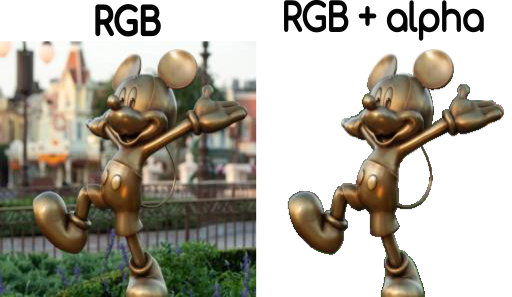

# In-the-wild Material Appearance Editing using Perceptual Attributes 

### [Project Page](https://dsubias.github.io/publication/in-the-wild_editing/) | [Paper](https://arxiv.org/pdf/2302.03619.pdf) | [Data](-)

An official **PyTorch**  implementation of [**In-the-wild Material Appearance Editing using Perceptual Attributes**](). 


[J. Daniel Subias](https://dsubias.github.io/#about)<sup>1</sup>,
[Manuel Lagunas](https://mlagunas.me/)<sup>2</sup>

<sup>1</sup>**Universidad de Zaragoza, I3A, Spain**, <sup>2</sup>**Amazon**

In **Eurographics 2023** (Oral Presentation)


## TL;DR quickstart
```
# Clone repository and enter in the folder
git clone git@github.com:dsubias/FaderNetworks-Materials.git
cd itw_editing

# Download pretrained models
bash download_models.sh

# Create a python environment
python -m venv itw_editing
pip install -r requirements.txt

# Create example image
python resize.py
python add_alpha.py

# Run the editing framework
test_network.py test_images/mikey.png 1.0 glossy test_glossy_1.png
```

If everything works without errors,  you can now go to `edited_images` and watch a teaser like this:


## Setup

Python 3 dependencies:

* [PyTorch 1.0+](https://pytorch.org)
* [tensorboardX 1.6+](https://github.com/lanpa/tensorboardX)
* [torchsummary](https://github.com/sksq96/pytorch-summary)
* [tqdm](https://github.com/tqdm/tqdm)
* [Pillow](https://github.com/python-pillow/Pillow)
* [easydict](https://github.com/makinacorpus/easydict)

Download the [trained weights](https://perso.liris.cnrs.fr/johanna.delanoy/data/2022_materials_generative_editing/models/normal_final.ckpt)

```
bash download_models.sh
```

We provide a requirements file including all of the above dependencies to create an environment. Create the python environment `itw_editing` by running:

```
python -m venv itw_editing
pip install -r requirements.txt
```

## Image format

To edit your own images of a single object, you can add new images to `test_images` in `PNG` format. The RGB channels must depict the object and background and the alpha channel must be the shiluete of the object like this:



To do this, you can copy the original RGB image in `original_images` and a masked version of the image (e.g generated by [remove.bg](https://www.remove.bg/) ) in `masked_images` and run:

```
python resize.py
python add_alpha.py
```

These commands resize the RGB image and the alpha channel to 256x256 px. and generate the final masked image in format `PNG`. You can download the rest of the synthetic and real data used in the paper [here](-).

## Organization of the code

* `agents` : The optimisation scheme. `STGANAgent` is an abstract agent that regroup some basic training functions, similar to Pytorch lighting abstraction.
* `models` : code of the STGAN architecture
* `datasets` : code to read the datasets
* `utils` : various utilities
* `configs` : configuration files to launch the trainings or test
* `experiments` : snapshots of experiments
* `test_images` : snapshots of experiments


## Training

For quickly start, you can simply use the following command to train:

  ```
  python main.py --config configs/train_model.yaml
  ```

After 50k iterations, you should get a teasers like this:

TODO: Change photo


If you want to modify some hyper-parameters, please edit them in the configuration file `./configs/train_stgan.yaml` following the explanations below:

  - `exp_name`: 256_median_new_glossy_final
  - `mode`: edit_images # train, edit_images, edit_video or plot_metrics
  - `cuda`: False
  - `ngpu`: 1
  - `gpus`: '1'
  - `output_name`: real_new_test_set
  - `checkpoint`: 54000 
  - `add_bg`: True
  - `test_file`: real_nuevo.txt
  - `att_max`: 1
  - `att_min`: 0
  - `num_samples`: 9
  - `att_value_frame`: 1
  - `dataset`: material
  - `data_root`: /media/raid/dsubias/data_45k
  - `out_root`: /media/raid/dsubias
  - `train_file`: attributes_dataset_train_new_median_illum.txt
  - `val_file`: attributes_dataset_synthetic.txt
  - `crop_size`: 480
  - `image_size`: 256
  - `data_augmentation`: True
  - `mask_input_bg`: True
  - `g_conv_dim`: 32
  - `d_conv_dim`: 32
  - `d_fc_dim`: 256
  - `g_layers`: 5
  - `d_layers`: 5
  - `shortcut_layers`: 4
  - `stu_kernel_size`: 3
  - `use_stu`: True
  - `deconv`: False
  - `one_more_conv`: True
  - `batch_size`: 32
  - `beta1`: 0.5
  - `beta2`: 0.999
  - `g_lr`: 0.0002
  - `d_lr`: 0.0002
  - `n_critic`: 7
  - `ld_n_critic`: 10
  - `thres_int`: 1.0
  - `use_d`: True
  - `lambda_gp`: 10
  - `lambda_1`: 50 # att discriminator (original value = 1)
  - `lambda_2`: 100 # att generator (original value = 10)
  - `lambda_3`: 1000 # reconstruction generator (original value = 100)
  - `attrs`: [ glossy ]
  - `uniform`: True
  - `default_att`: 0.5
  - `max_epochs`: 50
  - `lr_decay_iters`: 55000000
  - `summary_step`: 100
  - `sample_step`: 750
  - `checkpoint_step`: 750
  - `nt_step`: iteration steps per checkpoint saving operation.

## Acknowledgements

This code refers to the following two projects:

[1] [Implementation of [Delanoy et al. 22]](https://github.com/jdelanoy/generative-material-net) 

[2] [PyTorch implementation of STGAN](https://github.com/yunjey/stargan)
